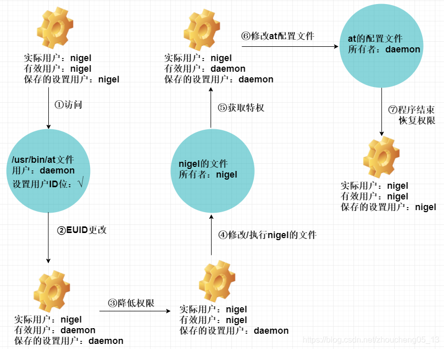

# euid，suid

## setuid基本规则
- 若进程具有超级用户权限，则将有效用户ID，实际用户ID和保存的设置用户ID都设置为uid
- 若进程无超级用户权限，且uid＝进程的实际用户ID或者uid=进程的保存设置用户ID，那么就将进程的有效用户ID设置为uid.但是不改变进程的实际用户ID和保存的设置用户ID。
- 若上述2个条件都不满足，则出错，errno置为EPERM。

## 例子

1. 我们在shell中执行at命令，shell会fork一个子进程，并到环境变量中去找到at文件，该文件开启了“设置用ID位”：
`ubuntu@VM-32-73-ubuntu:~$ ll /usr/bin/at
-rwsr-sr-x 1 daemon daemon 51464 Jan 15  2016 /usr/bin/at*
`
子进程的初始用户ID都为用户自身，假设为nigel。
2. 当子进程使用exec函数去执行at文件时，由于at开启了设置“设置用户ID位”，因此exec会将子进程的EUID设置为daemon，而SUID则复制EUID的值。
   (这里将suid设置为daemon是为了后面能够调用setuid函数来将euid再改到daemon)
3. at程序做的第一件事就是降低特权，以用户身份运行。它调用setuid函数把EUID设置为UID。
   (虽然进程没有超级用户权限，但是这里成功的原因是因为uid是nigel，所以可以把euid设置为nigel)
4. 子进程以nigel的身份去访问nigel的相关文件，都获得通过。
5. 当需要修改at的配置文件，添加任务记录时，需要获取特权。此时at程序调用setuid函数把EUID设置为daemon，由于SUID值为daemon，因此该函数可以修改。
   (如上面所说，如果进程的setuid是daemon，即使uid不是超级用户也可以执行setuid将euid设置为daemon)
6. 此时子进程的EUID为daemon，因此可以修改at的配置文件。
7. 程序结束时，子进程会调用setuid函数，由于此时的有效用户为daemon，因此该子进程拥有超级用户特权，setuid会将RUID、EUID和SUID都设置为nigel。

## 总结

如果一个程序需要访问特权文件，比如at配置文件，但是它有需要被所有用户执行，那么linux的方案就是通过euid来实现，将该程序设置为4755（4表示持有者s位）
那一个非特权用户（比如nigel）需要访问该特权程序（比如at）时，由于at程序s位被设置，exec时就会将其保存设置的uid设置为at程序的持有者daemon，
然后再调用setuid将进程的uid设置为nigel，进程可以访问nigel用户的配置文件，当需要访问daemon用户的文件时，就可以调用setuid来将自己的euid设置为daemon
这样程序再访问daemon文件时就不会再报错了。