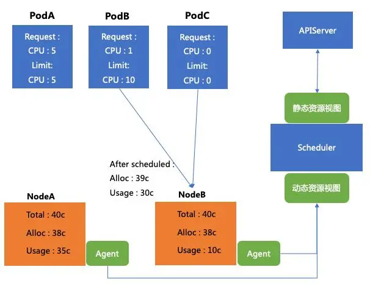
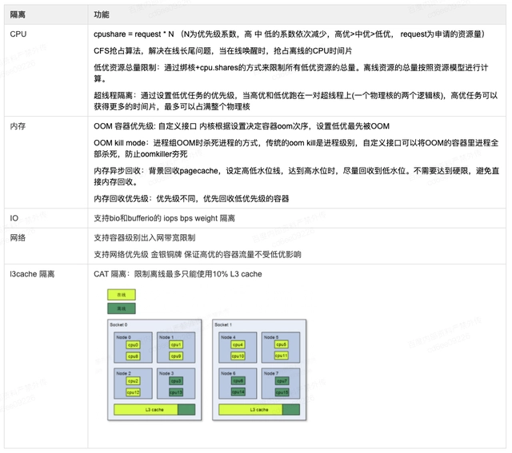

## 百度的离在线混部技术

参考文档：[百度混部介绍](https://baijiahao.baidu.com/s?id=1710816403670533834&wfr=spider&for=pc)

### qos分级
原生的k8s提供了三种不同类型的qos，分别为BestEffort，Burstable，Guaranteed。
对于Guaranteed类型的pod，其实本质上是不超卖的，因为其request=limit，调度器将一个pod调度到节点上时，考虑的是其request，分配之后减少的是节点的allocatable，
但是对于Burstable来讲本质上就是超卖。

### 动态资源调度
每个节点上都会有一个agent去收集单机的资源使用情况，将其汇报给调度器来做调度决策，百度的例子如下图：  
  
podB和podC都应该调度到NodeB上，但是由于这两个pod加一起request才是1c，但是实际使用量可能会达到20c，那么这就是超发，当NodeB上guaranteed的pod资源使用量紧张时，
就会对podB和podC进行压制和驱逐。

### 驱逐和压制
在单机的cgroup下，会有一个kubepods的目录，对于不同qos分级的pod，会放到不同的分级目录下，kubepods下会有guaranteed，burstable，besteffort三个目录，为了保证kubepods下会有guaranteed的qos，
单机的agent会根据当前机器的资源使用情况动态的调整burstable下的cgroup限制，比如某一时间段guaranteed下的pod资源使用量不高，我们可以适当调大burstable下的cgroup限制，
如果当前主机的cpu使用量上涨，那么就需要将burstable的cpu调低，其实最低就是burstable下request的总和，这一过程称之为压制，压制burstable/besteffort类型的pod的资源使用量。
besteffort的pod类似，先计算burstable和guaranteed的pod的cgroup，然后剩余的分配给besteffort， 如果说besteffort剩余量过少，那么就会启动驱逐，将besteffort下的pod驱逐走。  
其他更细粒度的压制和驱逐策略：  

百度在内核基础上扩展了现有的内核能力，以支撑离线业务的压制和驱逐。

### 其他调度能力引入
- **HPA能力引入**  
  比如离线pod的计算可能等价的，越多的pod计算的越快，可能用户直接把pod副本数调整到很大，但是因为超卖资源限制，很多pod都是pending状态，会给调度器带来很大的压力，
  因此让pod具有弹性能力是一个比较好的选择，这样可以减轻调度队列的压力。
- **多调度器**  
  基于质量的多调度器。对Besteffort的容器来说，在调度时调度器并不关心静态资源视图，也就是NodeAllocatableResource。调度器只关心这台机器上现在还剩多少可用资源，
  所以在资源视图的角度，天然就和其他两种质量的Pod不冲突. 基于这个前提，我们将Guaranteed和Burstable两种类型的Pod归并到一个调度器内进行调度， 
  而BestEffort类型的Pod则在另外一个离线调度器内调度。
- **等价类调度**  
  在一个调度周期内，使用相同PodTemplate生成的Pod, 在进行调度计算时一定会得到相同的Node列表。基于这个前提, 在调度上我们构造了等价类的概念，在调度时单位从Pod变成了PodEquivalenceGroup. 
  在优选结束后, 会按照Node分数的顺序来依次调度PodEquivalenceGroup中的所有Pod。这样处理相当于将O(n)的调度计算降为了O(1)。
- **并发调度**
  目前开源的Kubernetes调度器，无论是默认调度器还是社区的kube-batch， volcano都是依次进行调度的，队头阻塞的现象较为严重。在优先级相同的情况下， 
  最后一个Pod的调度延迟约等于队列内所有Pod的调度延迟之和。并发的关键在于如何解决冲突 : 在调度器内存中为每一个Node维护了一个版本号， 当Pod与Node进行Bind操作时， 
  会尝试对Node版本号进行+1的CAS操作，如果失败，则说明该Node已经发生过Bind 操作， 此时会将该Node重算并重新尝试调度。基于CAS + Version的机制， 我们实现了同优先级情况下， 
  Pod并发调度的方案。该方案可以带来4 ~ 8倍的调度性能提升。